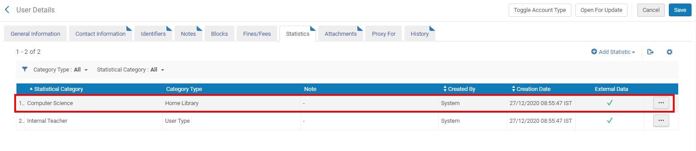
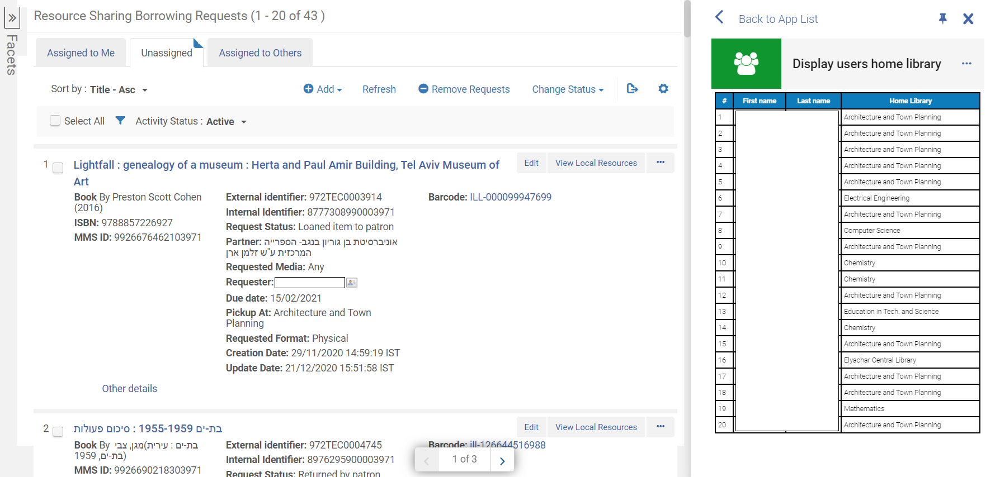
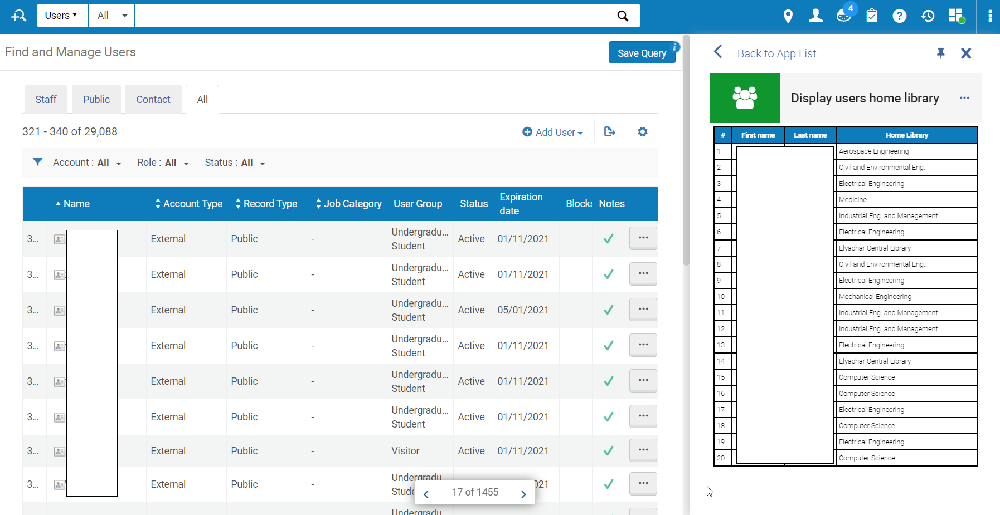

# Display users home library

# Overview

### Display "Home Library" field for users in different [Alma](https://www.exlibrisgroup.com/products/alma-library-services-platform/) screens.

With "Display users home library" Alma cloud app you can retrieve the following **"Home Library"** field for users:

# Daily use

Displaying "Home Library" field in screens that call **users** API, for example:
* Borrowing Requests:

* Find and Manage Users:

# Issues and defects
Please use the GitHub “Issues” to report defects

# License
[BSD 3-Clause License](./LICENSE)

